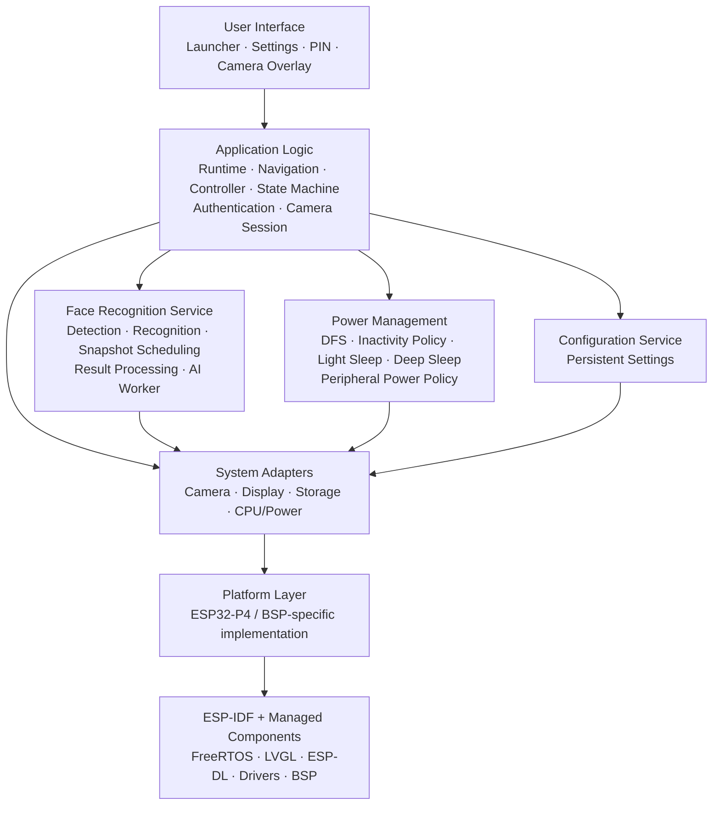

# Power Efficient Operation of an Edge AI Device (ESP32-P4)

Bachelor thesis project for a power-efficient, on-device face-recognition and door-access system built around the **Waveshare ESP32-P4-NANO**.

The system combines local Edge AI inference, camera-to-display processing, multi-user face recognition, PIN-based second-factor authentication, a touchscreen GUI, dynamic CPU power management, Light-sleep, Deep-sleep, peripheral power control, and wake-up performance instrumentation.

**Thesis:** *Power Efficient Operation of an Edge AI Device (Espressif ESP32-P4)*  
**Platform:** Waveshare ESP32-P4-NANO  
**Framework:** ESP-IDF 5.5.4 / FreeRTOS  
**Primary application:** `src_p4/`

---

## Purpose of This README

This README is the technical entry point for the GitHub repository.

Its purpose is to:

- explain what the Bachelor thesis project implements and why it exists;
- identify the main hardware and software components;
- provide a reproducible ESP32-P4 build and flashing procedure;
- explain the software architecture and the responsibilities of the main modules;
- summarize the power-management, AI, GUI, authentication, and wake-up behavior;
- document the main measured achievements of the thesis;
- help another developer understand where to start without first reading the complete source tree or thesis.

The README is intentionally a repository-level overview. Detailed implementation decisions, measurements, experiments, background theory, and references remain part of the Bachelor thesis and the source-code documentation.

---

## Description

The project investigates how a continuously operating **Edge AI face-recognition system** can reduce total board power consumption while still preserving useful response time and application functionality.

The application is designed as the embedded part of a door-access system. Camera frames are captured locally on the ESP32-P4, processed by the image pipeline, displayed on the attached MIPI-DSI screen, and analyzed by an on-device face-detection and face-recognition pipeline. No cloud inference is required for the authentication pipeline.

A recognized user proceeds to a **PIN-entry stage** as a second authentication factor. Multiple users can be enrolled using reference images stored on the microSD card.

Power optimization is applied to the complete system rather than only to the ESP32-P4 CPU. The implementation coordinates CPU frequency, AI scheduling, display brightness, camera operation, the ESP32-C6 wireless co-processor, Ethernet PHY, audio subsystem, microSD, touchscreen, and the display when entering lower-power states.

### Main Hardware

The project is centered around the **ESP32-P4-NANO** and uses the board-level peripherals required by the application, including:

- ESP32-P4 dual high-performance RISC-V cores
- 32 MB PSRAM
- ESP32-C6-MINI-1 wireless co-processor
- MIPI-CSI camera interface
- OV5647 camera
- MIPI-DSI display path
- 10.1-inch touch display
- Goodix GT9271/GT911-compatible touch interface
- IP101GRI Ethernet PHY
- ES8311 audio codec
- NS4150B audio amplifier
- microSD storage

---

## Repository Overview

```text
Bachelor_Thesis_ESP/
├── src_p4/                 # Main ESP32-P4 thesis application
│   ├── main/               # Application, services, platform adapters and UI
│   ├── managed_components/ # ESP-IDF / BSP managed dependencies
│   └── ...
├── src_c6/                 # ESP32-C6 support / companion projects
├── results/                # Measurement and evaluation results
├── tools/                  # Development / project tools
├── utilities/              # Flashing, logging and helper scripts
├── legacy/                 # Retained legacy material
├── power_patch_backups/    # Historical power-related development material
└── ...
```

The current `src_p4/main/` application is split into application logic, domain definitions, services, platform-specific adapters, diagnostics, and user-interface modules.

---

# Flashing Process

## Requirements

Before building the ESP32-P4 firmware, install and configure:

- **ESP-IDF 5.5.4**
- Git
- CMake/Ninja through the ESP-IDF environment
- Python dependencies installed by ESP-IDF
- A USB connection to the ESP32-P4-NANO

The examples below assume that the board appears as:

```text
/dev/ttyACM0
```

If your system assigns another serial device, replace `/dev/ttyACM0` with the correct port.

## 1. Clone the Repository

```bash
git clone <repository-url>
cd Bachelor_Thesis_ESP
```

## 2. Load ESP-IDF 5.5.4

```bash
source ~/esp/esp-idf-v5.5.4/export.sh
```

Verify:

```bash
idf.py --version
```

Expected project toolchain:

```text
ESP-IDF v5.5.4
```

## 3. Enter the ESP32-P4 Project

```bash
cd src_p4
```

## 4. Clean Only the Build Directory

```bash
rm -rf build
```

> **Important:** Do not use `idf.py fullclean` as the normal clean procedure for this project. The repository can contain intentional project-specific changes inside managed components. Removing only `src_p4/build` preserves those component sources while still forcing a clean application rebuild.

## 5. Reconfigure

```bash
idf.py reconfigure
```

## 6. Build

```bash
idf.py build
```

## 7. Flash

```bash
idf.py -p /dev/ttyACM0 flash
```

## 8. Open the Serial Monitor

```bash
idf.py -p /dev/ttyACM0 monitor
```

Exit the ESP-IDF monitor with:

```text
Ctrl + ]
```

## Complete Build and Flash Sequence

```bash
source ~/esp/esp-idf-v5.5.4/export.sh

cd src_p4
rm -rf build

idf.py reconfigure
idf.py build
idf.py -p /dev/ttyACM0 flash
idf.py -p /dev/ttyACM0 monitor
```

---

# Software Architecture

The ESP32-P4 application follows a **layered and interface-oriented architecture**. The design separates high-level application decisions from hardware-specific implementation details.

The main goals are:

- separation of concerns;
- high cohesion inside individual modules;
- low coupling between unrelated subsystems;
- information hiding;
- dependency inversion;
- replaceable hardware and AI backends;
- maintainable power-management behavior.

## High-Level Architecture



## Application Logic

Application coordination is located mainly under:

```text
src_p4/main/app/
```

Responsibilities include:

- boot/runtime coordination;
- navigation;
- application state transitions;
- camera-session ownership;
- authentication workflow;
- configuration integration;
- coordination between UI, AI, power management, and platform services.

Important logical states include:

```text
BOOTING
LAUNCHER
SETTINGS
CAMERA_ACTIVE
AUTHENTICATING
PIN_ENTRY
LIGHT_SLEEP
DEEP_SLEEP
```

Simplified flow:

```text
BOOTING
   |
   v
LAUNCHER
   |
   v
CAMERA_ACTIVE
   |
   +---- face recognized ----> AUTHENTICATING
                                |
                                v
                             PIN_ENTRY
                                |
                                v
                           CAMERA_ACTIVE
```

# Wake-Up Timing and Logging

The current firmware measures recovery time until the **first successfully presented camera frame**.

## Light-Sleep Timing

Scope:

```text
WAKE_CONFIRMED_TO_FIRST_FRAME
```

The timer begins when touchscreen activity is confirmed as a valid Light-sleep wake event.

## Deep-Sleep Timing

Scope:

```text
APP_RUNTIME_TO_FIRST_FRAME
```

Because real Deep-sleep resets the processor and `esp_timer_get_time()`, this software metric does **not** include ROM/bootloader latency.

## Persistent Wake Logs

Every completed Light-sleep or Deep-sleep wake measurement is written to a separate file on the microSD card:

```text
/sdcard/logs/
```

FAT-compatible filenames are used:

```text
L000001.LOG
L000002.LOG
D000003.LOG
L000004.LOG
```

`L` identifies Light-sleep and `D` identifies Deep-sleep.

Example:

```text
wake_entry=3
mode=DEEP_SLEEP
start_event=APP_RUNTIME_ENTRY
end_event=FIRST_CAMERA_FRAME
start_us=63524
end_us=5087454
elapsed_us=5023930
elapsed_ms=5023.930
elapsed_sec=5.023930
scope=APP_RUNTIME_TO_FIRST_FRAME excludes_ROM_BOOTLOADER
```

The end timestamp is captured **before** the SD-card file is written, so filesystem I/O is not included in the measured wake latency.

---

# Achievements

The developed system fulfills the main functional and power-management requirements defined for the Bachelor thesis.

## Functional Achievements

- Local face detection on the ESP32-P4
- Local face recognition on the ESP32-P4
- Multi-user enrollment and recognition
- microSD-based enrollment data
- PIN-based second-factor authentication
- Touchscreen launcher
- Runtime settings interface
- PIN-entry GUI
- Direct live camera preview
- Face-information overlay
- Persistent configuration
- Modular state-machine-based application control
- Pluggable AI backend interfaces
- Light-sleep recovery without a complete application reboot
- Deep-sleep with physical GPIO wake-up
- Direct camera startup after Deep-sleep wake without recreating the launcher
- Persistent per-wake timing logs on microSD

## Measured Power Achievements

| Operating mode | Average current | Reduction vs. full Active |
|---|---:|---:|
| Full Active, no optimization | **0.7849 A** | Reference |
| Optimized Active | **0.3762 A** | **52.1%** |
| Light-sleep | **0.0336 A** | **95.7%** |
| Deep-sleep | **0.0189 A** | **97.6%** |

The optimized Active implementation reduced average current from **784.9 mA to 376.2 mA** while remaining operational.

Light-sleep reduced average current to **33.6 mA**.

Deep-sleep produced the lowest measured average current, **18.9 mA**, corresponding to an approximately **97.6% reduction** compared with the full-power Active reference.

# Thesis Scope

The repository accompanies the Bachelor thesis:

> **Power Efficient Operation of an Edge AI Device (Espressif ESP32-P4)**

The central objective is system-level energy efficiency, including the processor, AI workload, camera, display, touch controller, wireless co-processor, Ethernet, audio, storage, and the software coordinating them.

The resulting application demonstrates that an embedded AI system can retain authentication and user-interface functionality while substantially reducing average current during inactive periods.
